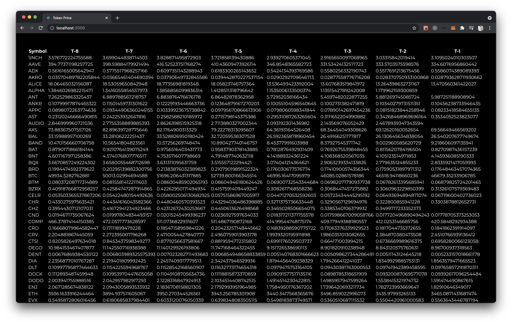

# TokenPX



Shows the spot prices of tokens listed on [Pokket](https://pokket.com/) over the past week from Coingecko API\
Visit the project [here](https://tokenpx.netlify.app).\

## Quick start

```
yarn install
yarn start
```

Runs the app in the development mode.\
Open [http://localhost:3000](http://localhost:3000) to view it in the browser.\

## Technologies used

[React](https://reactjs.org/)\
[Coingecko API](https://www.coingecko.com/en/api)
